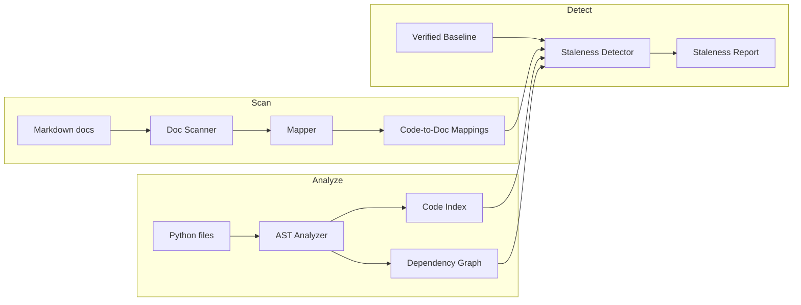

# doc-updater

Detect stale documentation by analyzing code-to-doc relationships.

**doc-updater** builds a graph of your Python codebase, scans your markdown docs for references to code elements, and tells you exactly which docs are stale when code changes — including transitive dependencies.

---

## Table of Contents

- [Why](#why)
- [Quick Start](#quick-start)
- [How It Works](#how-it-works)
- [Commands](#commands)
- [Workflow](#workflow)
- [Configuration](#configuration)
- [Interactive Graph](#interactive-graph)
- [Claude Code Integration](#claude-code-integration)
- [Development](#development)
- [Built With](#built-with)

---

## Why

Code changes. Docs don't update themselves. You end up with:
- API docs describing parameters that no longer exist
- Guides referencing functions that were renamed
- Tutorials using patterns that changed three PRs ago

**doc-updater** catches this automatically. After a code change, one command tells you which docs need attention and why.

---

## Quick Start

### Prerequisites

- Python >= 3.12

### Install

```bash
pip install -e .
```

### First Run

```bash
cd your-python-project

# Initialize (creates .doc-updater/, updates .gitignore)
doc-updater init

# Set current state as the "verified" baseline
doc-updater check --baseline

# ... make code changes ...

# Check which docs are now stale
doc-updater check
```

Example output:

```
╭─────────────────────────────╮
│     Staleness Summary       │
│                             │
│ Total docs:      4          │
│ Healthy:         2          │
│ Stale:           1          │
│ Possibly stale:  1          │
│ Unverified:      0          │
╰─────────────────────────────╯

docs/auth-guide.md — stale
  • [signature] src/auth.py::AuthManager.validate_token (confidence=0.90, hops=0)
    Signature of 'src/auth.py::AuthManager.validate_token' has changed

docs/cache-guide.md — possibly_stale
  • [transitive] src/cache.py::cache_lookup (confidence=0.54, hops=1)
    Dependency 'src/cache.py::cache_lookup' has changed (1 hop(s) away)
```

---

## How It Works



### Three-tier hashing

Each code element (function, class, method) gets three hashes:

| Hash | What it captures | Staleness signal |
|------|-----------------|------------------|
| `signature_hash` | Name, parameters (including defaults and kinds), return type | **High** — the API contract changed |
| `body_hash` | `ast.dump()` of body statements only | **Medium** — behavior changed |
| `source_hash` | Raw source text | Not used for staleness (comments/formatting aren't staleness) |

### Transitive detection

If your doc references `validate_token()` and `validate_token` calls `cache_lookup()`, a change to `cache_lookup` is flagged as **transitive staleness** with confidence that decays per hop (default: 0.6x per hop, max 3 hops).

### Reference-lost detection

If a documented function is renamed or deleted, it's flagged as `reference_lost` — the doc references something that no longer exists.

---

## Commands

| Command | Description |
|---------|-------------|
| `doc-updater init` | Initialize in a repo (creates `.doc-updater/`, updates `.gitignore`) |
| `doc-updater index` | Parse Python files, build code index + dependency graph |
| `doc-updater scan` | Scan markdown docs, auto-detect code references |
| `doc-updater check --baseline` | Set current state as verified baseline |
| `doc-updater check` | Detect stale docs (exit code 1 if any stale) |
| `doc-updater check --json` | Machine-readable JSON output (for CI) |
| `doc-updater status` | Show last check summary |
| `doc-updater show <doc>` | Detailed tree view for one doc |
| `doc-updater graph` | Export interactive HTML dependency graph |
| `doc-updater clean` | Remove all doc-updater data from the repo |

### Key flags

```bash
doc-updater check --json              # JSON output for CI
doc-updater check --direct-only       # Skip transitive checks
doc-updater check --max-hops 5        # Increase transitive depth (default: 3)
doc-updater index --skip-errors       # Continue past syntax errors
doc-updater graph --export json       # Export graph as JSON instead of HTML
doc-updater graph -o /tmp/graph.html  # Custom output path
doc-updater clean --keep-gitignore    # Remove data but keep .gitignore entry
```

---

## Workflow

### Day-to-day use

```bash
# After code changes, check docs
doc-updater check

# See details for a specific doc
doc-updater show docs/auth-guide.md

# After updating the docs, re-baseline
doc-updater check --baseline
```

### CI integration

The baseline must be created **locally** and committed — CI only checks against it:

```bash
# One-time setup (run locally, commit .doc-updater/state.json)
doc-updater init
doc-updater check --baseline
git add .doc-updater/state.json
git commit -m "chore: add doc-updater baseline"
```

Then in CI, just check:

```yaml
# GitHub Actions example
- name: Check doc staleness
  run: |
    pip install doc-updater
    doc-updater check  # exits 1 if docs are stale vs. committed baseline
```

> **Note:** Remove `.doc-updater/` from `.gitignore` if you want to share the
> baseline across the team. Only `state.json` is needed — `index.json` and
> `mappings.json` are regenerated automatically by `check`.

The `--json` flag produces machine-readable output:

```json
{
  "summary": {
    "total": 4,
    "healthy": 3,
    "stale": 1,
    "possibly_stale": 0,
    "unverified": 0
  },
  "stale_docs": [
    {
      "doc": "docs/auth-guide.md",
      "status": "stale",
      "issues": [
        {
          "element_id": "src/auth.py::AuthManager.validate_token",
          "change_type": "signature",
          "confidence": 0.90,
          "hops": 0,
          "detail": "Signature of 'src/auth.py::AuthManager.validate_token' has changed"
        }
      ]
    }
  ]
}
```

---

## Configuration

doc-updater stores all data in `.doc-updater/` (auto-added to `.gitignore`):

| File | Purpose |
|------|---------|
| `index.json` | Code elements with hashes |
| `edges.json` | Dependency graph edges |
| `file_analyses.json` | Per-file analysis results |
| `mappings.json` | Doc-to-code reference mappings |
| `state.json` | Verified baseline + last report |

### Staleness thresholds

| Parameter | Default | Description |
|-----------|---------|-------------|
| `--max-hops` | 3 | Maximum graph traversal depth for transitive detection |
| Confidence decay | 0.6x per hop | How fast confidence drops with distance |
| Min confidence | 0.20 | Issues below this aren't reported |
| Stale threshold | >= 0.70 | Max issue confidence for STALE status |

---

## Interactive Graph

```bash
doc-updater graph
# Opens graph.html with interactive vis.js visualization
```

Features:
- **Dark theme** with color-coded nodes (classes=blue diamonds, methods=light blue, functions=green)
- **Stale nodes** highlighted in red
- **Search** to filter nodes by name
- **Hover tooltips** with element details
- **Edge types**: solid = calls, dashed = inherits

Export as JSON for programmatic use:

```bash
doc-updater graph --export json -o graph.json
```

---

## Claude Code Integration

A `/doc-check` skill is included at `claude-code/doc-check.md`. It lets you check doc staleness interactively inside Claude Code:

```
> /doc-check
```

The skill runs `doc-updater check --json`, interprets results, and suggests specific fixes for stale docs.

---

## Development

### Setup

```bash
git clone <repo-url>
cd doc-updater
pip install -e ".[dev]"
```

### Test

```bash
pytest -v           # 241 tests, 96% coverage
pylint src/         # Target: 10.00/10
pylint tests/       # Target: clean
```

### Project layout

<details>
<summary>Click to expand</summary>

```
src/doc_updater/
├── cli.py                  # Click CLI (init, index, scan, check, status, show, graph, clean)
├── analyzer/
│   ├── base.py             # Data models (CodeElement, Parameter, GraphEdge, etc.)
│   ├── python_analyzer.py  # Python AST visitor with three-tier hashing
│   └── graph.py            # networkx dependency graph + HTML export
├── docs/
│   ├── scanner.py          # Markdown parser, extracts code references
│   └── mapper.py           # Resolves references to code element IDs
├── staleness/
│   ├── detector.py         # Direct + transitive staleness detection
│   └── reporter.py         # Rich CLI + JSON output formatting
└── store/
    └── json_store.py       # JSON persistence for index, mappings, state
```

</details>

### Architecture notes

- **`CodeElement.raw_calls`** stores unresolved AST call strings; the graph is the sole source of resolved dependencies
- **`body_hash`** hashes only body statements (not signature/decorators) so signature changes don't alter it
- **MODULE elements** per file use `ast.dump(tree)` for `body_hash` so comments/formatting don't trigger staleness
- **File-path references** in docs resolve to MODULE elements, not to every element in the file
- **`analyze_file()`** accepts an optional `repo_root` param to produce relative element IDs

---

## Built With

- [click](https://click.palletsprojects.com/) — CLI framework
- [networkx](https://networkx.org/) — Dependency graph operations
- [rich](https://rich.readthedocs.io/) — Terminal formatting
- [vis.js](https://visjs.org/) — Interactive graph visualization (CDN, no install)
- Python stdlib: `ast`, `hashlib`, `json`, `pathlib`, `subprocess`
